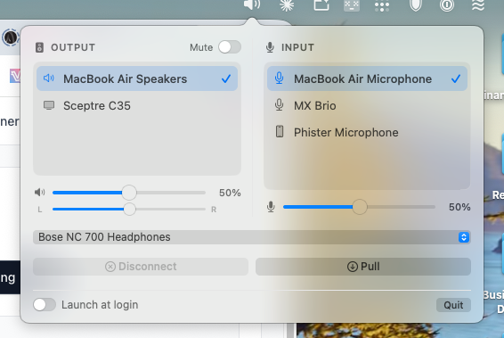

# AudioBar

A native macOS menu bar app for switching audio output and input, with optional two-Mac Bluetooth headphone handoff. Swift/AppKit, no dependencies. MIT licensed.

The peer host in the examples below is a hostname or Tailscale IP of your other Mac.



Menu bar app for switching the Mac's default output and input devices without opening System Settings → Sound.

Click the speaker icon. Output devices are on the left, input devices on the right. The current default is marked. One click makes that device the default for its column. Switching output also sets the default system output device, so alert sounds follow. Under the lists: output volume, mute, and left/right balance, plus input volume when the device exposes it.

The icon shows mute and rough volume level. The lists update when devices connect or disconnect, and when the default changes somewhere else.

AudioBar does not record audio and does not ask for microphone access. There is no input level meter.

Disconnect drops the current Bluetooth headphones or speaker from this Mac. It is enabled when the current output or input is Bluetooth. If several Bluetooth devices are listed, each of those rows has its own disconnect button.

Pull moves a paired Bluetooth device onto this Mac. It asks the other Mac's AudioBar to disconnect that address, then connects it here and makes it the default output and input. If more than one paired audio device is available, a menu under Pull chooses which one. The menu starts on the Bluetooth device you last used as the default, or on a paired device named like Bose NC 700. If the other Mac does not answer, Pull still connects the device locally. The line at the bottom of the panel shows what happened.

Both Macs listen on port 47653. Requests must send the shared secret in the `X-AudioBar-Secret` header. Peers have to come from Tailscale (`100.64.0.0/10`, or an IPv6 `fd7a:` address). macOS may ask to allow incoming connections, and to allow Bluetooth, the first time you open the app.

## Requirements

- macOS 14 or later (including macOS 26)
- Apple Silicon or Intel
- Xcode Command Line Tools (`xcode-select --install`), which provide `swiftc` and `codesign`

## Build

```bash
./build.sh
```

Writes an ad-hoc signed `build/AudioBar.app`.

## Install and run

On the MacBook Air, point AudioBar at the Mini. This generates a secret and prints it:

```bash
./install.sh mac-mini
```

On the Mini, point AudioBar at the Air and pass that same secret:

```bash
./install.sh macbook-air <secret>
```

You can also choose the secret yourself and pass it on both machines:

```bash
# macbook-air
./install.sh mac-mini <secret>

# mac-mini
./install.sh macbook-air <secret>
```

That writes `~/Library/Application Support/AudioBar/config.json` (`peerHost` and `secret`) and copies the secret to `~/Library/Application Support/AudioBar/secret`. Running `./install.sh` again with a peer host keeps the existing secret if you do not pass a new one. Running it with no arguments rebuilds and relaunches without changing the config.

The script replaces `~/Applications/AudioBar.app` and opens it. There is no Dock icon. The speaker sits in the menu bar (check the menu bar overflow if it is crowded).

`./install.sh` is the single command to rebuild and relaunch.

Launch at login is the switch in the panel footer. macOS may ask you to allow it under System Settings → General → Login Items. Quit is in that same footer. When the panel is open, Command-Q also quits.

Devices that do not expose volume, mute, or balance get those controls disabled instead of failing the switch. Aggregate devices you create in Audio MIDI Setup still appear. Hidden devices, automatic aggregates, and aggregate sub-devices are left out, same as Sound settings.
